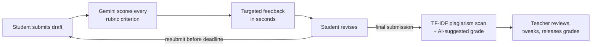
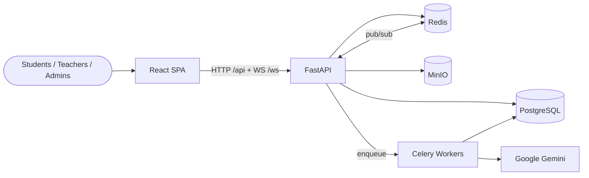
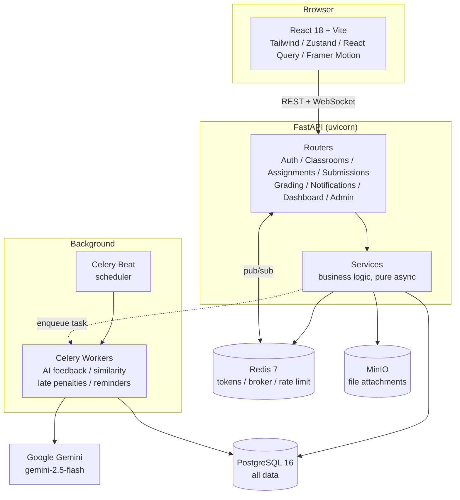

<div align="center">

# ClassPulse

### The classroom platform that grades with you, not after you.

Students submit drafts and get instant, rubric-aligned AI feedback before the deadline.
Teachers grade in half the time with AI-suggested scores and real-time plagiarism flags.

[](https://github.com/sumanthd032/ClassPulse/actions/workflows/ci.yml)


[Quick Start](#quick-start) · [How It Works](#the-core-loop) · [Architecture](#high-level-architecture) · [API](#api)

</div>

---

## The Core Loop

Most platforms only see student work once, after the deadline, when it is too late to learn anything. ClassPulse closes the loop before submission.



1. **Submit a draft.** A Celery worker sends it to Gemini, which scores every rubric criterion and writes targeted feedback in seconds.
2. **Revise and resubmit.** Up to N drafts before the deadline. The student improves while the teacher does nothing.
3. **Final submission triggers a plagiarism scan.** Every final is compared against the cohort. Pairs above 80% cosine similarity flag the teacher in real time over WebSocket.
4. **Teacher grades fast.** AI pre-fills a suggested level and marks per criterion. The teacher accepts, tweaks, or overrides, then releases grades to the class.

---

## What You Get

<table>
<tr>
<td width="33%" valign="top">

### Students
- Instant AI feedback on every draft
- A clear rubric breakdown, not just a number
- File attachments on submissions
- Live notifications when grades drop
- Personal grade-trend charts

</td>
<td width="33%" valign="top">

### Teachers
- AI-suggested scores per criterion
- Real-time plagiarism alerts
- Full gradebook with one-click PDF export
- Classroom analytics and at-risk detection
- Stream, materials, topics, comments

</td>
<td width="33%" valign="top">

### Admins / HOD
- Platform-wide analytics
- User and classroom oversight
- Role-based access control
- Automated weekly at-risk reports

</td>
</tr>
</table>

> **Always-on automation.** Celery Beat applies late penalties at midnight, fires deadline reminders at 8am, and runs at-risk detection weekly. No manual cron work required.

---

## High-Level Architecture

The big picture: a React SPA talks to a FastAPI backend, which persists state, streams real-time events, and offloads heavy work (AI feedback, plagiarism, scheduled jobs) to background workers.



---

## Architecture

A closer look at the components and what flows between them.



**Stack:** React 18, TypeScript, FastAPI, Python 3.11, SQLAlchemy (async), Pydantic v2, PostgreSQL 16, Redis 7, MinIO, Celery, Google Gemini (`gemini-2.5-flash`), Docker.

---

## Quick Start

**Prerequisites:** Docker and Docker Compose, plus a [Google AI Studio](https://aistudio.google.com/) (Gemini) API key.

```bash
git clone https://github.com/sumanthd032/ClassPulse.git
cd ClassPulse
cp backend/.env.example backend/.env
```

Set two values in `backend/.env` (everything else has working local defaults):

```env
JWT_SECRET=<run: python -c "import secrets; print(secrets.token_hex(32))">
LLM_API_KEY=<your Gemini API key>
```

Then bring up the whole stack:

```bash
docker compose up --build
```

| Service | URL |
|---|---|
| Frontend | http://localhost:3001 |
| API | http://localhost:8000 |
| Swagger docs | http://localhost:8000/api/docs |

First build takes about 3 minutes. After that it is cached and starts in seconds.

<details>
<summary><b>Hot-reload dev setup (run backend and frontend separately)</b></summary>

```bash
# Backend: db + redis + migrate + api(--reload) + worker + beat
cd backend
cp .env.example .env          # set JWT_SECRET and LLM_API_KEY
docker compose -f docker-compose.dev.yml up --build
# Postgres on localhost:5433, Redis on localhost:6380

# Frontend: Vite proxies /api and /ws to :8000 automatically
cd frontend
npm install
npm run dev                   # http://localhost:3000
```

</details>

---

## API

Interactive Swagger UI lives at `/api/docs`. The endpoints that carry the product:

| Method | Path | What it does |
|---|---|---|
| `POST` | `/api/v1/assignments/{id}/drafts` | Submit a draft, triggers AI feedback |
| `POST` | `/api/v1/assignments/{id}/final` | Submit final, triggers plagiarism scan |
| `POST` | `/api/v1/submissions/{id}/grade` | Grade a submission (teacher) |
| `GET` | `/api/v1/assignments/{id}/gradebook` | Full grade matrix |
| `GET` | `/api/v1/assignments/{id}/gradebook/pdf` | Download gradebook as PDF |
| `POST` | `/api/v1/classrooms/join` | Join a classroom by code |
| `GET` | `/api/v1/me/dashboard` | Role-aware dashboard stats |
| `WS` | `/ws?token=<jwt>` | Real-time notification stream |

---

## Project Layout

```
ClassPulse/
├── backend/                 # FastAPI service
│   ├── app/
│   │   ├── models/          # SQLAlchemy ORM models
│   │   ├── schemas/         # Pydantic v2 request/response
│   │   ├── routers/         # Route handlers
│   │   ├── services/        # Business logic (pure async)
│   │   ├── workers/         # Celery tasks (AI, plagiarism, cron)
│   │   └── utils/           # Security, LLM client, MinIO, WebSockets
│   └── alembic/             # Database migrations
├── frontend/                # React + Vite SPA
│   └── src/
│       ├── api/             # Typed API clients (one per domain)
│       ├── components/      # UI primitives, layout, charts, command palette
│       ├── pages/           # Route-level screens
│       ├── stores/          # Zustand state
│       └── hooks/           # useAuth, useWebSocket
└── docker-compose.yml       # Full-stack, production-like
```

---

## License

[MIT](LICENSE) Copyright 2026 Sumanth D
